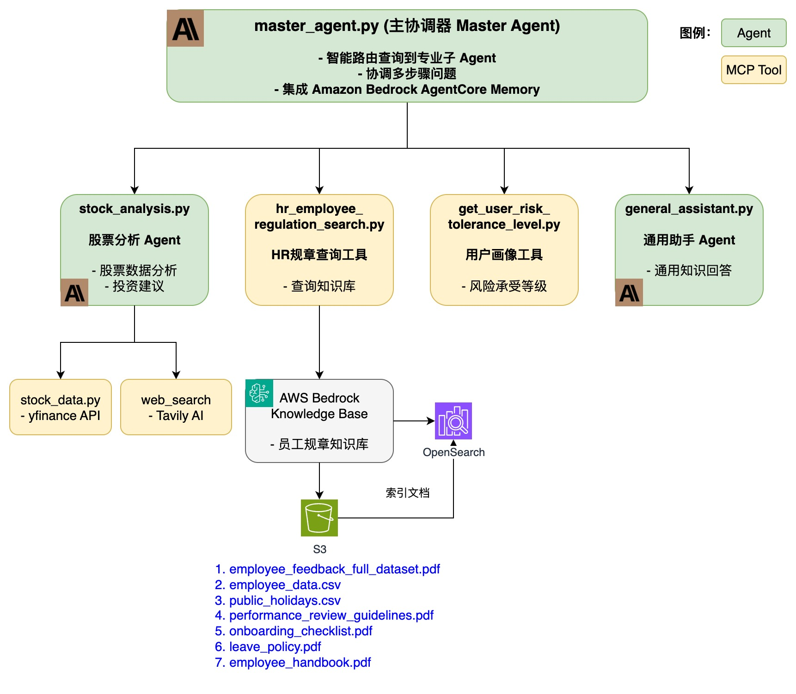

# Strands Multi-Agent System

企业级多智能体协作系统，基于 AWS Strands Agents SDK 框架构建，提供股票分析、HR规章查询等专业服务。

## 功能特性

- **主协调器**: 智能路由用户查询到相应的专业 Agent
- **股票分析代理**: 提供实时股票数据分析和投资建议
- **HR规章代理**: 基于 AWS Bedrock Knowledge Base 的员工规章查询
- **用户画像代理**: 获取用户风险承受能力等个人信息
- **通用助手**: 处理其他通用问题

## 系统架构

### Agent 协作架构


### 调用流程

1. 用户输入 → master_agent (主协调器)
2. master_agent 分析查询类型并路由到相应 Agent/Tool
3. 专业 Agent 调用所需 Tools 完成任务
4. 结果返回给 master_agent
5. master_agent 整合结果并返回用户

## 环境要求

- Python 3.8+
- AWS 账户及凭证配置
- AWS Bedrock 访问权限 (Claude Sonnet 4.5, Claude Haiku 4.5)
- AWS Bedrock Knowledge Base (用于 HR 规章查询)
- Tavily AI API Key (用于网络搜索)

## 安装

```bash
pip install -r src/requirements.txt
```

## 配置

设置以下环境变量：

```bash
export LOG_LEVEL=INFO
export AWS_DEFAULT_REGION=us-west-2
export KNOWLEDGE_BASE_ID=<your-knowledge-base-id>  # Bedrock 知识库 ID

# AWS 凭证 (通过 AWS CLI 配置或环境变量)
export AWS_ACCESS_KEY_ID=<your-access-key>
export AWS_SECRET_ACCESS_KEY=<your-secret-key>
```

## 运行

```bash
cd src
./run.sh
```

或直接运行：

```bash
python src/master_agent.py
```

## 使用示例

```
> 帮我分析一下AAPL股票
[路由到 stock_analysis Agent，调用 stock_data_lookup 和 web_search 工具]

> 公司的年假政策是什么？
[路由到 hr_employee_regulation_search Tool，查询 Knowledge Base]

> 查询用户 user_123 的风险承受能力
[路由到 get_user_risk_tolerance_level Tool]

> 什么是量子计算？
[路由到 general_assistant Agent]
```

## 项目结构

```
src/
├── agents/                      # 专业代理
│   ├── stock_analysis.py        # 股票分析 Agent
│   ├── hr_employee_regulation.py # HR规章查询 Tool
│   ├── user_profile.py          # 用户画像 Tool
│   └── general_assist.py        # 通用助手 Agent
├── tools/                       # 工具函数
│   ├── stock_data.py            # yfinance 股票数据
│   └── web_search.py            # Tavily AI 网络搜索
├── agentcore/                   # Agent Core 组件
│   └── memory_helper.py         # Bedrock Memory 集成
├── utils/                       # 工具类
│   ├── __init__.py
│   └── logger.py                # 日志配置
├── master_agent.py              # 主协调器入口
├── requirements.txt             # 依赖包
└── run.sh                       # 启动脚本
```

## 技术栈

- **Strands Agents**: 多智能体协作框架
- **AWS Bedrock**: Claude Sonnet 4.5, Claude Haiku 4.5 模型
- **AWS Bedrock Knowledge Base**: RAG 知识库检索增强生成
- **AWS Bedrock Agent Core**: Memory 管理 (短期/长期记忆)
- **boto3**: AWS Python SDK
- **yfinance**: 股票数据获取
- **Tavily AI**: 网络搜索引擎

## License

MIT
